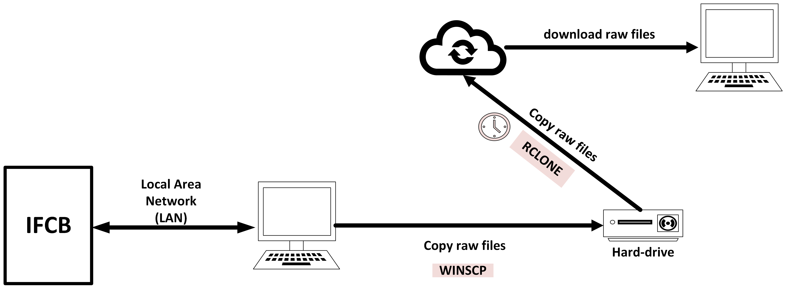
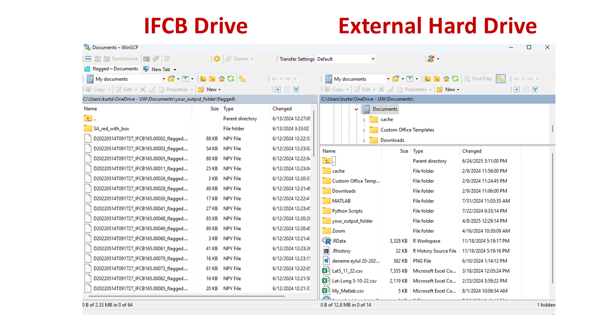
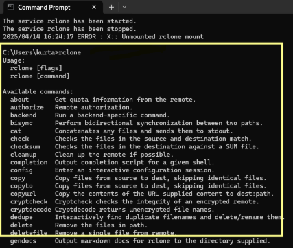
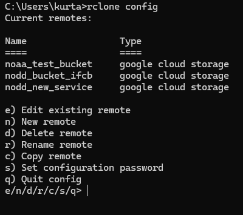
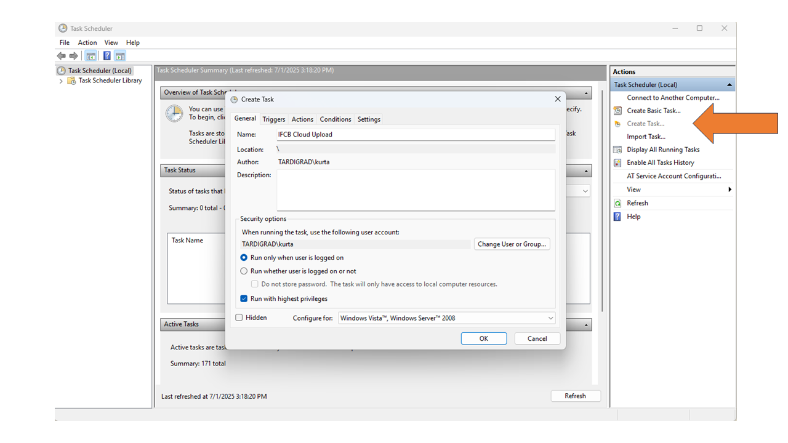
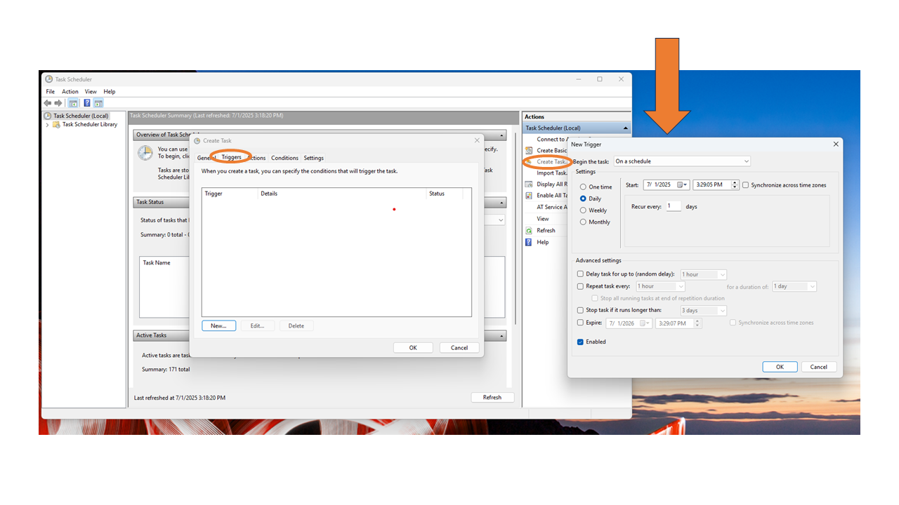
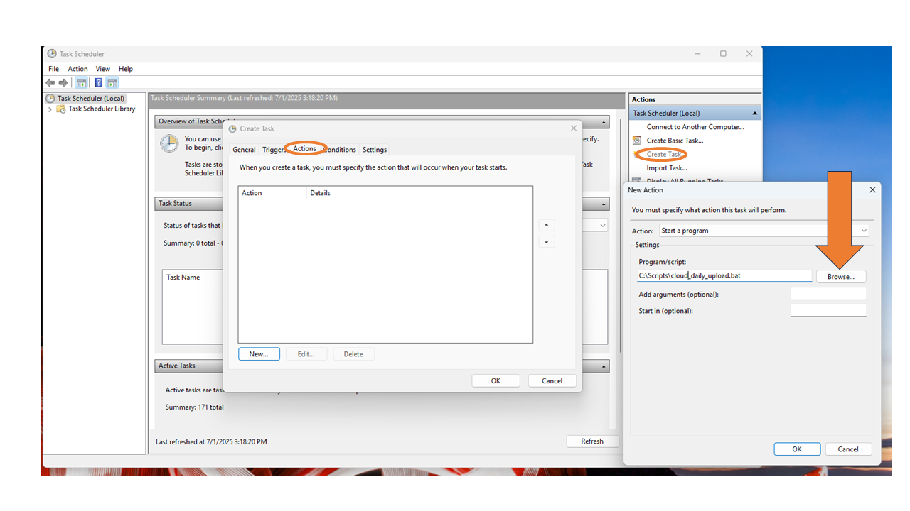

## **Accessing and Storing the Data**

The IFCB runs on a Linux-based operating system and is connected to a local computer via a Local Area Network (LAN). This allows direct access to its internal storage for data retrieval (using a file manager software) as well as  instrument control with a graphical user interface (GUI) software (Fig. 1). While the IFCB itself operates on  Linux, users can access the data from any operating system, and a Linux machine is not required for data transfer or management. IFCB data can be retrieved in two main ways: remotely, via cloud-based transfer during the cruise (if an internet connection is available), or locally, by copying the data directly from the instrument to a laptop or external hard drive after the cruise. In many field situations where remote access is not possible, the local transfer method remains the only approach for data retrieval and backup storage.




### **1-Local Hard Drive Backup with WINSCP**
For onboard backups, we used the file manager WinSCP on a Windows laptop due to its user-friendly GUI. WinSCP established a secure connection between the IFCB's internal storage and the external hard drive using secure file transfer protocol (SFTP). The transfer was scheduled to run at one-minute intervals, enabling frequent and automated backups during deployment.




As Figure 2 shows Windows WINSCP GUI can arrange manual or automatic copying (with  script) of files from IFCB drive to External Hard Drive and provide a visual of both drives. 


### **2-Cloud Upload with R Clone** 

*STEP 1 RCLONE Download and Set Up*

Rclone: is a command-line program to manage files on cloud storage. It is
capable of handling multiple cloud storage services, like Google Drive and Amazon S3
and others. We can use rclone to copy, move, sync, or list files across the internet and
our local file systems. The purpose of using Rclone for AFCB is to copy raw IFCB data
from the ship to the Google AFSC cloud, allowing us to process it remotely and monitor
the data during the cruise. It is a downloadable program (https://rclone.org/downloads/)

FOR WINDOWS USERS <br>
WinFsp: short for Windows File System Proxy, is a set of tools that helps
you create virtual drives on your Windows computer. The purpose of using WinFsp is to
assist Rclone in creating a virtual drive that looks and behaves like a regular drive on
your computer. It operates behind the scenes, enabling programs like Rclone to treat
cloud storage as if it were a physical hard drive connected to your computer.It is a downloadable program (https://winfsp.dev/)

After downloading to check if rclone is on the Windows PATH or not open a command prompt and write: 

```
rclone
```
You should see:<br>



Note: If you dont see the image, you will need to add rclone to your pathway, an example of how to do it in first two minutes (https://youtu.be/QPqN1SXixQg?si=cLLLU5tLc0UTYx6S) 

*STEP 2 RCLONE Configuration and key file*

*RCLONE needs key files (.json) to align with the cloud you want to upload. You should save those key files in your computer: C:\Users\yourname\Documents\rclone_keys\my_key.json<br>

Open Command Prompt:

```
rclone config
```
You should see:<br>


Type n for new remote. Then follow the steps:<br>
1- Name your remote <br>
2- Choose cloud provider (Google Cloud Storage)<br>
3- Use service account credentials (**y**/n)<br>
4- Enter the path to service account credential file, your key 
```
C:\Users\yourname\Documents\rclone_keys\my_key.json
```
6- Leave advance config? (y/**n**) and auto config? (y/**n**) as default<br>
7- Test the remote, your bucket name is the name listed in the cloud
```
rclone ls your_remote_name:your-bucket-name
```
You can manually write the below code to copy IFCB files to the cloud
```
rclone copy "C:\Users\yourname\Desktop\data_folder" your_remote_name:your-bucket-name/IFCB_folders ^
  --config="C:\Users\yourname\AppData\Roaming\rclone\rclone.conf" ^
  --log-file="C:\Scripts\rclone_log.txt" ^
  --log-level=DEBUG ^
  --retries=10
```

### **3-Schedule the COPY command**

FOR Windows computers: Use built-in Windows Task Scheduler<br>
Windows includes a built-in tool called Task Scheduler, which allows you to run tasks (like an rclone copy command) automatically on a schedule. STEPS are:<br>

*STEP-1 Create a .bat file*<br>
Open a Notepad and paste your copy command:
```
@echo off 
echo Starting IFCB cloud upload at %date% %time% >> C:\Scripts\ifcb_upload_log.txt

"C:\rclone\rclone.exe" copy "C:\Users\yourname\Desktop\data_folder" your_remote_name:your-bucket-name/IFCB_folders ^
  --config="C:\Users\yourname\AppData\Roaming\rclone\rclone.conf" ^
  --log-file="C:\Scripts\rclone_upload_debug.txt" ^
  --log-level=DEBUG ^
  --retries=10

echo Finished IFCB upload at %date% %time% >> C:\Scripts\ifcb_upload_log.txt
type C:\Scripts\rclone_upload_debug.txt >> C:\Scripts\ifcb_upload_log.txt  
```
Save file to C:\Scripts\ as:
cloud_daily_upload.bat

*STEP-2 Create a Scheduled Task*
You can test manually if the cloud_daily_upload.bat is working by clicking on it.<br>

1-Open Task Scheduler<br>
2-Click Create Task<br>
3-In General Tab Name:<br>
    Name:IFCB Cloud Upload<br>
    Run only when user is logged on<br>
    Run with highest privileges<br>
    

4- In Triggers tab:<br>
    New Trigger<br>
    Begin the Task : On a Schedule<br>
    Daily<br>
    Start: Pick Time<br>
    At the bottom check:<bt>
        UNCHECK: Delay task for up to (random delay)<br>
        UNCHECK: Repeat task every 5 minutes for a duration of 1 day<br>
        Expire: Pick Time<br>
    

5- In Actions tab:<br>
    New Action<br>
    Action: Start a Program<br>
    Program/script: Browse 'the cloud_daily_upload.bat" <br>
    


